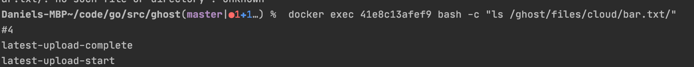

# ghost
Go Storage hack project

Playing around with distributed systems in Go.  Basic implementation of chain replication object storage. 

To run 
```
go install ./cmd/...
docker-compose up
```
to upload or download a file
```
$GOPATH/bin/cp foo.txt doge://cloud/bar.txt
$GOPATH/bin/cp doge://cloud/bar.txt foobar.txt
```
(yes, `doge` is the official protocol for ghost)

### Design
How it works: `cp` command uses the `client` to hit `entrypoint`, which tells the client which of the main storage nodes to call and then `client` hits a `storage` node for reads and writes.  

Storage nodes are organized in `chains`, each having a `head`, a `tail` and `replicas`.  Writes only happen to the `head` and propogate to the `tail` and reads happen to any node and `entrypoint` concurrently pings each node in the right `chain` to see which is the best node to read from

We also safely keep a version number of files to in case a new file is uploaded, and safely delete old files 

